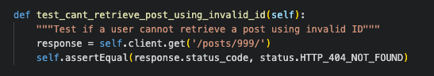

# **MewMes - API**

This is the backend API for the MewMes Frontend React app. It contains the models and logic to allow the frontend application to perform CRUD operations.
MewMes is a content-sharing platform designed for cat memes appreciators: users can sign up and share their favourite cat memes.
The app includes registration and sign-up, users can add memes, react to memes, follow or unfollow another user, react to memes, as well as save memes for future viewing.

- [MewMes Deployed Back-End Page](https://mewmes-dc42376a8874.herokuapp.com/)
- [MewMes Deployed Front-End Page](https://mewmes-ila-3228af34fcea.herokuapp.com/)
- [Front-End repository](https://github.com/Ila-bura/MewMes_API)


## **Table of Contents** ##
    
  - [Table of Contents](#table-of-contents)
  - [Database Schema](#database-schema)
  - [User Stories](#user-stories)
  - [Testing](#testing)
    - [Unit Testing](#unit-testing)
      - [Posts List View testing:](#posts-list-view-testing)
      - [Posts Detail View testing:](#posts-detail-view-testing)
    - [Code Validation](#validation)
    - [Manual Testing](#manual-testing)
      - [Testing CRUD functionality:](#testing-crud-functionality)
      - [Testing URLs](#testing-urls)
  - [Technologies Used](#technologies-used)
    - [Languages](#languages)
    - [Libraries, Frameworks, and Programs](#libraries-frameworks-and-programs)
  - [Bugs](#bugs)
    - [Unresolved](#unresolved)

------------------------------------------------------------------------------------------------------------

## **Database Schema**

- The plan for this project was loosely based on the Code Institute Moments walkthrough project. 
- Most of the models are similar except for the Saved model, which has been customised to better suit the needs of MewMes app users.
- The Votes and Downvotes models were also added to serve the purposes of MewMes app.


## **API Endpoints**
```
/
dj-rest-auth/login/
dj-rest-auth/logout/
dj-rest-auth/registration/
dj-rest-auth/password/change/
dj-rest-auth/token/refresh/
profiles/
profiles/<int:pk>/
posts/
posts/<int:pk>/
reply/
reply/<int:pk>/
saved/
saved/<int:pk>/
followers/
followers/<int:pk>/
votes/
votes/<int:pk>/
downvotes/
downvotes/<int:pk>/
```

## **User Stories**

This project was designed using agile methodologies. User stories and unresolved bugs are recorded on the [Project Board](https://github.com/users/Ila-bura/projects/22) for both frontend and backend tasks.

## **Testing**

### **Unit Testing**

* The following tests were created following the CI walkthrough.
The command *python manage.py test* was used. All tests passed.

#### **Posts List View testing:**


#### **Posts Detail View testing:**





### **Code Validation**

- The Python code was monitored for errors and adjusted throughout development using the gitpod IDE problems tab.
- All Python files were opened one by one and any problems were manually corrected: mainly minor issues such as blank line at end of file.
- The only issues left unfixed from the problems tab are the line too long warnings from the automatically generated settings.py AUTH_PASSWORD_VALIDATORS variable which contains long strings. 
These strings were left intact rather than breaking them up into smaller strings for the sake of avoiding potential issues. This seems to be the general consensus by reseraching the matter on the Code Institute Slack channels.

All Python files pass through [PEP8 Code Institute](https://pep8ci.herokuapp.com/) with no issues found.

### **Manual Testing**

- The MewMes API was tested manually throughout development using Django REST framework. 
- API Endpoints and CRUD functionality was tested for each feature. 
- The API endpoints were also checked in the deployed site to see if they were working and checked throughout the frontend development to ensure front and backend integration as each feature was being built in the React app.

### **Test cases**
Below are some test cases that were implemented throughout development to check correct functionality: 
- Check login, logout and registration functionality.
- Check that access to memes, reply, profiles, followers, votes and downvotes POST, PUT and DELETE Metods are restricted to authorised users. 
- Get methods are checked via api endpoints.
- Filter function was checked using keywords.
- POST method was tested for Posts, reply, saved, votes, downvotes and followers
- POST method for dj-rest-auth/registration/ to create a profile tested
- POST method for /dj-rest-auth/password/change/ to change password tested
- PUT mehtod for profiles/id, posts/id and reply/id tested
- DELETE method for posts/id, reply/id, saved/id, votes/id, downvotes/id, followers/id tested

#### **Testing CRUD functionality throughout the apps:**

| App | Create | Read | Update | Delete |
|---|---|---|---|---|
| Posts | Pass | Pass| Pass | Pass |
| Profiles | n/a | Pass | Pass | n/a |
| Reply | Pass | Pass | Pass | Pass |
| Followers | Pass | Pass | n/a | Pass |
| Votes | Pass | Pass | n/a | Pass |
| Downvotes | Pass | Pass| n/a | Pass|

#### **Testing URLs**

| **URL** | **Result** |
| --- | --- |
| root | Pass |
| /profiles/ | Pass |
| /profiles/:id/ | Pass |
| /posts/ | Pass |
| /posts/:id/ | Pass |
| /posts/create/ | Pass |
| /reply/ | Pass |
| /reply/:id |Pass |
| /followers/ | Pass |
| /followers/:id/ | Pass|
| /saved/ | Pass|
| /saved/:id/ | Pass |
| /votes/ | Pass |
| /votes/:id/ | Pass |
| /downvotes/ | Pass |
| /downvotes/:id/ | Pass |

#### **Testing with Admin credentials**

<details><summary>Profiles</summary>

</details>

<details><summary>Posts</summary>

</details>

<details><summary>Reply</summary>

</details>

<details><summary>Followers</summary>

</details>

<details><summary>Saved</summary>

</details>

<details><summary>Votes</summary>

</details>

<details><summary>Downvotes</summary>

</details>

### **Integration Testing**
The MewMes API has also gone through integration testing via testing the features on the frontend site. 
- The Testing documentation can be found [here](https://github.com/Ila-bura/mewmes/blob/main/README.md#testing).
- Bugs encountered during this process were frontend bugs. See more details [here](https://github.com/Ila-bura/mewmes/blob/main/README.md#bugs).
  
## **Technologies Used**

### **Main Languages**

- [Python](https://www.python.org/) 

- [HTML](https://www.w3schools.com/html/html_intro.asp)

- [CSS](https://www.w3schools.com/css/css_intro.asp)

- [JS](https://reactjs.org/)

### **Databases**
- [PostgreSQL](https://www.postgresql.org/)
- 
### **Cloud storage and deployment services**
- [Cloudinary](https://cloudinary.com/)
    - Used to store media files and images.
- [Heroku](https://www.heroku.com/)
    - Used to host the deployed sitewhat
- [ElephantSQL]() 
   - Used to host and operate the PostgresSQL database

### **Frameworks, tools and libraries**
#### API Back-End
- [Django Rest Framework](https://www.django-rest-framework.org/)
    - The frmaework used to build the api
- [Psycopg2](https://pypi.org/project/psycopg2/)
   - PostgreSQL database adapter for python
- [django_filters](https://django-filter.readthedocs.io/en/stable/guide/install.html) 
    - Provides filtering capabilities for Django querysets in the API views.
    - In the frontend UI, this will allow users to search with keywords to find relevant content. 
- [dj_rest_auth](https://dj-rest-auth.readthedocs.io/en/latest/installation.html)
    - Extends Django REST Framework's authentication and provides authentication views.
- [rest_framework.authtoken](https://pypi.org/project/django-rest-authtoken/)
    - Provides token-based authentication for the REST Framework.
- [dj_rest_auth.registration](https://dj-rest-auth.readthedocs.io/en/latest/installation.html)
    - Handles user registration views and functionality for dj-rest-auth.
- [allauth](https://django-allauth.readthedocs.io/en/latest/installation.html)
    - Provides user authentication, registration, and account management functionalities.
- [corsheaders](https://pypi.org/project/django-cors-headers/)
    - Handles Cross-Origin Resource Sharing (CORS) headers for handling requests from different origins.
- [JSON WEB tokens](https://django-rest-framework-simplejwt.readthedocs.io/en/latest/getting_started.html)
    - Authenticates requests through a JSON web token provided in a request header.
    - ManageS account authorisation, keep user logged-in for 24 hours.
- [dbdiagram.io](https://dbdiagram.io/home): for the database schema diagram.

### **Installed Libraries and packages**
The following libraries and packages were installed using the pip3 install command:
```
'django<4'
dj3-cloudinary-storage
Pillow
djangorestframework
django-filter
dj-rest-auth
'dj-rest-auth[with_social]'
djangorestframework-simplejwt
dj_database_url psycopg2
gunicorn
django-cors-headers
```

## **Bugs**
### **Unresolved**
None to my knowledge as of now.

## **Project Setup**

- Create a new repository using the Code Institute template repository.
- Run the command pip3 install 'django<4' in the terminal to install Django.
- Run the command django-admin startproject MewMes_API . in the terminal.
- Run the command pip install django-cloudinary-storage in the terminal to install Cloudinary Storage.
- Run the command pip install Pillow - this library adds the image processing capabilities we need for this project.
- Once these dependencies are installed we need to add them to the "Installed apps" section in settings.py.
  - Note the placement and terms used for this input into installed apps:

        ```
        'cloudinary_storage',
        'django.contrib.staticfiles',
        'cloudinary',
        ```
- Create an env.py file in the top directory.
  - Inside the env.py file, import the os module and set up the os.environ with the Cloudinary URL you can retrieve from the account you've set up.
- In the settings.py file, set up a variable called "CLOUDINARY_STORAGE" and use the environment variable used to set up in the env.py file to declare this value.
- Next, define the setting called "MEDIA_URL" and set it to "/media/" so the settings know where to store our image files.
- Finally, define a variable called "DEFAULT_FILE_STORAGE" and set it to "MediaCloudinaryStorage".

## **Deployment**

The first step of deployment is setting up the JWT tokens:
- First install the package in the terminal window, using the command:

    *pip install dj-rest-auth==2.1.9*
- In the settings.py file add the following to the "Installed Apps" section.

    *'rest_framework.authtoken',*

    *'dj_rest_auth',*

- Next, add the following URLs to the urlpatterns list:

    *path('dj-rest-auth/', include('dj_rest_auth.urls')),*

- In the command terminal, migrate the database just added by typing:

    *python manage.py migrate*

- Next we want to add the feature to enable the registration of users. Type the following into the terminal:

    *pip install 'dj-rest-auth[with_social]'*

- Add the following to the "Installed Apps" section in the settings.py file:

    ```
    'django.contrib.sites',
    'allauth',
    'allauth.account',
    'allauth.socialaccount',
    'dj_rest_auth.registration',
    ```

- Add SITE_ID value, which is placed under INSTALLED APPS List:

    *SITE_ID = 1*

- Next add the registration URLs to the urlpatterns list, as follows:

    *path('dj-rest-auth/registration/',*

    *include('dj_rest_auth.registration.urls')),*

- Now add JWT tokens functionality:
  - Install the djangorestframework-simplejwt package by typing the following into the terminal command window:

        *pip install djangorestframework-simplejwt==4.7.2*

- In the env.py file, create a session authentication value (differentiates between Dev and Prod mode):

    *os.environ['DEV'] = '1'*

- In the settings.py file, use the Dev value above to differentiate between Dev and Prod Modes & add pagination which is placed under SITE_ID:

    ```REST_FRAMEWORK = {
    'DEFAULT_AUTHENTICATION_CLASSES': [( 
        'rest_framework.authentication.SessionAuthentication' 
        if 'DEV' in os.environ 
        else 'dj_rest_auth.jwt_auth.JWTCookieAuthentication'
    )]
    }
    ```

* To enable token authentication, put the following under the above step:

    *REST_USE_JWT = True*

- To ensure tokens are sent over HTTPS only, add the following:

    *JWT_AUTH_COOKIE = 'my-app-auth'*

- Next, declare cookie names for the access and refresh tokens by adding:

    ```
    JWT_AUTH_SECURE = True
    JWT_AUTH_REFRESH_COOKIE = 'my-refresh-token'
    ```

- Create a new serializers.py file in the api folder. Then import the following files at the top of the new serializers file:

    *from dj_rest_auth.serializers*

    *import UserDetailsSerializer*

    *from rest_framework import serializers*

- Next create the profile_id and profile_image fields:

    ```
    class CurrentUserSerializer(UserDetailsSerializer):
        profile_id = serializers.ReadOnlyField(source='profile.id')
        profile_image = serializers.ReadOnlyField(source='profile.image.url')
        class Meta(UserDetailsSerializer.Meta):
            fields = UserDetailsSerializer.Meta.fields + ('profile_id', 'profile_image')
    ```

- Overwrite the default USER_DETAILS_SERIALIZER - Place below the JWT_AUTH_REFRESH_COOKIE = 'my-refresh-token':

    *REST_AUTH_SERIALIZERS = {'USER_DETAILS_SERIALIZER': 'drf_api.serializers.CurrentUserSerializer'}*

- Next, in the terminal command window:

    *1: Run migrations*

        python manage.py migrate

    *2: Update the requirements text file:*

        pip freeze > requirements.txt

    *3: git add, commit and push.*

### **Adding the root route:**

* Create a views.py file in the API folder. Set up the imports in the views.py file:

    *from rest_framework.decorators import api_view*

    *from rest_framework.response import Response*

- Create root route and return custom message:

    ```
    @api_view()
    def root_route(request):
        return Response({"message": "Welcome to my API!"})
    ```

* In the urls.py file, import:

    *from .views import root_route*

- Add the URL to urlpatterns list:

    ```
    urlpatterns = [
    path('', root_route)
    ]
    ```

### **Adding JSON Renderer**

- In the settings.py file, add Pagination:

    ```
    REST_FRAMEWORK = {
    ...,
    'DEFAULT_PAGINATION_CLASS':  'rest_framework.pagination.PageNumberPagination',
    'PAGE_SIZE': 10,
    }
    ```

### **Adding Pagination**

- In the settings.py file, set JSON Renderer if Dev environment is not present. Placed below, but separate from, the REST_FRAMEWORK list:

    ```
    REST_FRAMEWORK = {
    ...
    }

    if 'DEV' not in os.environ:
        REST_FRAMEWORK['DEFAULT_RENDERER_CLASSES'] = [
            'restframework.renderers.JSONRenderer'
        ]
    ```

### **Date and time formatting - General Formatting:**

- In the settings.py file, format the Date and time in REST_FRAMEWORK list:

    ```
    REST_FRAMEWORK = {
    ...
    'DATETIME_FORMAT': '%d %b %Y'
    }
    ```

### **Date and time formatting - Reply and Post:**

- In the reply app, create the serializers.py app. Then set the imports up in the file:

    *from django.contrib.humanize.templatetags.humanize import naturaltime*

- Set fields within the ReplySerializer class:

    *created_at = serializers.SerializerMethodField()*

    *updated_at = serializers.SerializerMethodField()*

- Set methods, which are placed underneath fields:

    ```
    def get_created_at(self, obj):
        return naturaltime(obj.created_at)
    
    def get_updated_at(self, obj):
        return naturaltime(obj.updated_at)
    ```

* Next add, commit, and push the new additions.

### **Create Heroku App with Heroku PostGres**

- Log into Heroku, and create a new app. (The name must be unique)

- Log in to your ElephantSQL account, and click "create new instance".

- Set up your plan:
  - Give your plan a Name (this is commonly the name of the project)
  - Select the Tiny Turtle (Free) plan
  - You can leave the Tags field blank

- Click “Select Region”, then click “Review” and then click "Create instance".

- Go back to the ElephantSQL dashboard and click on the database instance name for this project.

- Copy your ElephantSQL database URL using the Copy icon. It will start with postgres://

### **In heroku.com**

- Open your App in Heroku, go to the settings tab, and click "Reveal config vars".

- Add a Config Var called DATABASE_URL: The value should be the ElephantSQL database URL.

### **Install and configure extra libraries and connect to your database:**

- Install dj_database_url by typing in the command terminal window:

    *pip install dj_database_url*

- In the settings.py file, import the following:

    *import dj_database_url*

- Separate the Dev and Prod Environments, as follows:

    ```
    DATABASES = {
    'default': ({
        'ENGINE': 'django.db.backends.sqlite3',
        'NAME': BASE_DIR / 'db.sqlite3',
    } if 'DEV' in os.environ else dj_database_url.parse(
        os.environ.get('DATABASE_URL')
    ))
    }
    ```

- Next, install gunicorn. By typing in the command terminal:

    *pip install gunicorn*

- Create Procfile (noting the capital "P"). Inside the file add:

    *release: python manage.py makemigrations && python manage.py migrate*

    *web: gunicorn drf_api.wsgi*

- In the settings.py, set the "ALLOWED_HOSTS" to:

    *['<YOURAPPNAME>.herokuapp.com', 'localhost']*

- In the command terminal, install CORS, by typing:
    *pip install django-cors-headers*

- Then add to "INSTALLED_APPS" section in settings.py:

```
    INSTALLED_APPS = [
        'django.contrib.admin',
        'django.contrib.auth',
        'django.contrib.contenttypes',
        'django.contrib.sessions',
        'django.contrib.messages',
        'cloudinary_storage',
        'django.contrib.staticfiles',
        'cloudinary',
        'rest_framework',
        'django_filters',
        'rest_framework.authtoken',
        'dj_rest_auth',
        'django.contrib.sites',
        'allauth',
        'allauth.account',
        'allauth.socialaccount',
        'dj_rest_auth.registration',
        'corsheaders',

        'profiles',
        'posts',
        'reply',
        'saved',
        'followers',
        'votes',
        'downvotes',    

    ]

```

* Add to MIDDLEWARE  list: (place at the top of the MIDDLEWARE list)

    ```
    MIDDLEWARE = [
    'corsheaders.middleware.CorsMiddleware',
    ...
    ]
    ```

- Set the ALLOWED_ORIGINS for the network requests made to the server: (placed under MIDDLEWARE_LIST)

    ```
    if 'CLIENT_ORIGIN' in os.environ:
        CORS_ALLOWED_ORIGINS = [
            os.environ.get('CLIENT_ORIGIN')
    ]
    else:
        CORS_ALLOWED_ORIGIN_REGEXES = [
            r"^https://.*\.gitpod\.io$",
    ]

    ```

- Allow Cookies and allow front end app and API be deployed to different platforms:

    *CORS_ALLOW_CREDENTIALS = True*
    *JWT_AUTH_SAMESITE = 'None'*

- Set the remaining env variables:

    *os.environ['SECRET_KEY'] = 'CreateRandomValue'*

- In the settings.py file - replace the ‘insecure’ key with the environment variable:

    *SECRET_KEY = os.environ.get('SECRET_KEY')*

- Replace the DEBUG Setting to be only true in Dev and False in Prod Modes:

    *DEBUG = 'DEV' in os.environ*

- In Heroku - Add your config vars i.e. copy and paste values from env.py into Heroku Config Vars, and add the DISABLE_COLLECTSTATIC var:

    *CLOUDINARY_URL, SECRET_KEY*

    *DISABLE_COLLECTSTATIC = 1*

- Back in GitHub in the command terminal - Update the requirements file, then add, commit and push the changes.

    *pip freeze > requirements.txt*

### **Final steps**

- Back in Heroku in the deploy tab: Select the Deployment Method (GitHub), select the project repository name from Github, and connect. Next in the Manual deploy section, choose the Master Branch, then click Deploy Branch.

- Once complete, click "Open App" to view.

### **Steps to Fork the repository**

1. Log in to GitHub.
2. Go to the repository [MewMes_API](https://github.com/Ila-bura/MewMes_API).
3. Click the Fork button in the top right hand corner.
4. A copy of the repo will be available in your GitHub repositories list

#### **Steps to clone the repository**
1. Log in to GitHub.
2. Go to the repository [MewMes_API](https://github.com/Ila-bura/MewMes_API).
3. Click on the green code button next to the green gitpod button.
4. Select how you would like to clone, ie. with HTTPS, SSH or GitHub CLI, and copy the link provided.
5. Open the terminal of your IDE and change the current working directory to the location you want to use for the cloned directory.
6. Type the git clone command followed by the link you copied in step 4.
7. Set up your virtual environement and install the packages from requirements.txt.
8. To install packages type the following command into the terminal: pip3 install -r requirements.txt

## **Credits**

### **Sources**

This project is a variation and largely based on the [Code Institute Moments](https://github.com/Code-Institute-Solutions/drf-api/tree/ed54af9450e64d71bc4ecf16af0c35d00829a106) walkthrough project.
It contains models and logic from that project which have bee modified for the purpose of MewMes cat memes sharing app.

### **Acknowledgments**

- My mentor at Code Institute - Martina Terlevic.

### **Media**

- The two images used for the default profile and the default post were dowloaded from the CI walkthrough and uploaded on Cloudinary.
